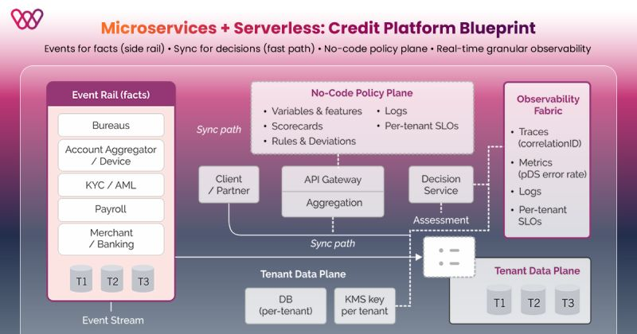

# Credit at the Edge: Microservices & Serverless for Lending Journeys

Author: Ramdas  
Source: LinkedIn

---

## Introduction

As digital lending grows rapidly, many financial institutions face a challenge:  
legacy systems make it difficult to scale credit operations quickly.

Modern cloud architectures using **microservices and serverless technologies**
can help lenders build flexible, scalable, and resilient credit platforms.

---

## Architecture Concept

The blueprint proposes a lending platform built around:

- Microservices architecture
- Serverless computing
- Event-driven design
- Real-time observability
- NoCode policy configuration

This approach allows systems to evolve faster while remaining scalable and maintainable.

---

## Two-Lane Architecture Pattern

One interesting idea mentioned in the discussion is separating system flows into two lanes:

### 1. Event Lane (Facts)

Events represent **facts that happened in the system**, such as:

- Loan application submitted
- Credit score retrieved
- Payment received

Event streams help systems stay **loosely coupled and scalable**.

### 2. Decision Lane (Synchronous Path)

A shorter synchronous path handles **critical decision-making steps**, such as:

- Credit approval decisions
- Risk evaluation
- Customer eligibility checks

This separation prevents performance bottlenecks and avoids tightly coupled systems.

---

## NoCode Policy Layer

Another key component is a **NoCode policy layer**.

This allows business teams to configure policies without waiting for software development cycles.

Benefits include:

- Faster product launches
- Rapid policy changes
- Reduced dependency on engineering teams

---

## Observability

Real-time observability is essential in such architectures.

Monitoring helps multiple teams share the same operational visibility:

- Product teams
- Risk teams
- Operations
- Engineering

This ensures faster debugging and improved system reliability.

---

## Impact for Digital Lending

This architecture pattern helps credit platforms:

- Scale quickly
- Reduce dependency on legacy systems
- Launch lending products faster
- Build resilient distributed systems

It is particularly relevant for **embedded lending, supply-chain finance, and digital credit platforms**.

---
## Architecture Diagram

---
## Reference

Original LinkedIn Post:  
https://www.linkedin.com/posts/ramramdas_credit-microservices-serverless-activity-7402612958368874496-9FvC/
